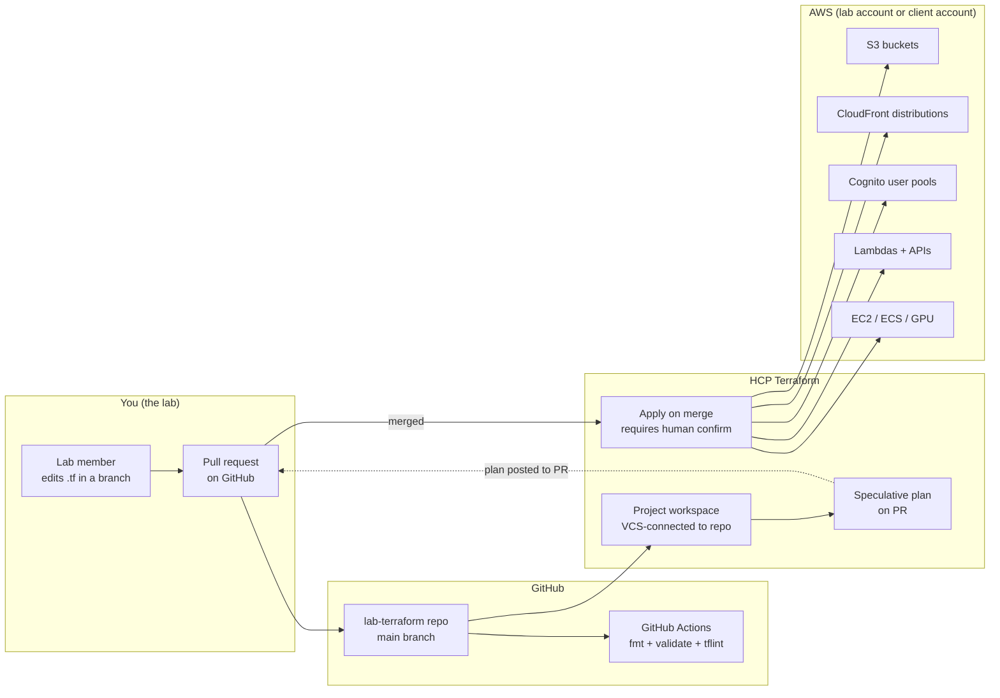
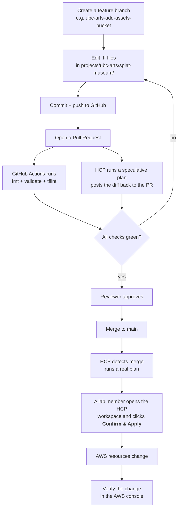
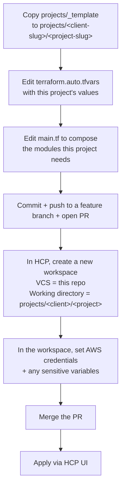
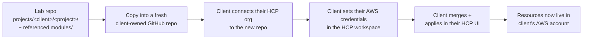

# Lab Terraform — Staff Handbook

This document is for everyone in the lab. You do not need to be a Terraform expert to read it. If something here is unclear, that's a bug — please open an issue or ping whoever owns DevOps that week.

---

## Table of contents

1. [What this repo is](#1-what-this-repo-is)
2. [How the pieces fit together](#2-how-the-pieces-fit-together)
3. [Daily workflow — making a change](#3-daily-workflow--making-a-change)
4. [Starting a new client project](#4-starting-a-new-client-project)
5. [Delivering a project to a client (transplant)](#5-delivering-a-project-to-a-client-transplant)
6. [Conventions you must follow](#6-conventions-you-must-follow)
7. [What lives where (folder map)](#7-what-lives-where-folder-map)
8. [FAQ / troubleshooting](#8-faq--troubleshooting)

---

## 1. What this repo is

The lab builds VR, AR, and 3D web experiences (Gaussian splat scenes, WebXR apps, gated educational portals) for university clients. Almost every project needs the same AWS pieces: object storage for assets, a CDN to serve them globally, user sign-in, sometimes a small backend API, occasionally GPU compute for asset processing.

Instead of clicking around the AWS console for every project (slow, easy to forget steps, impossible to audit), we describe each project as **Terraform code** in this repo. Terraform reads our code, talks to AWS, and makes AWS match what the code says. If we delete a line, Terraform deletes the resource. If we change a setting, Terraform updates it.

We do not run Terraform on our laptops. The university OS blocks it, and we wouldn't want to anyway — laptops differ, credentials get lost, state gets corrupted. Instead, **HCP Terraform** (HashiCorp's hosted service, also called Terraform Cloud) is connected to this GitHub repo. When code lands here, HCP sees it, plans the change, and (with a human confirming) applies it to AWS.

> **Short version:** GitHub holds the truth. HCP turns the truth into AWS resources. Lab members never touch the AWS console for things this repo owns.

---

## 2. How the pieces fit together



There are three "moving parts" you need to know:

| Part | What it does | Where it lives |
|------|--------------|----------------|
| **GitHub repo** | Stores the Terraform code. Reviews happen here as pull requests. | github.com — this repo |
| **HCP Terraform workspace** | One per client project. Pulls the project's `.tf` files from this repo, runs the plan, applies after a human approves. Holds the AWS credentials and the Terraform state. | app.terraform.io — lab's HCP organization |
| **AWS account** | Where the actual resources live. The lab has a shared account for development; clients have their own at delivery. | aws.amazon.com — different account ID per use |

---

## 3. Daily workflow — making a change

You want to add a new S3 bucket to the `ubc-arts/splat-museum` project. Here's the loop:



**Things to know:**

- You never run `terraform apply`. The HCP UI button does it.
- The speculative plan on the PR is your safety net. Read it. If it says "destroy 14 resources" and you only meant to add a bucket, **do not merge.**
- Pull requests are reviewed by another lab member. No self-merge for production projects.

---

## 4. Starting a new client project



**Step-by-step:**

1. In your branch, copy `projects/_template/` to `projects/<client-slug>/<project-slug>/`. Slugs are lowercase, hyphen-separated, no spaces. Example: `projects/ubc-arts/splat-museum/`.
2. Open the new folder's `terraform.auto.tfvars` and fill in `client_name`, `project_name`, `environment`, `aws_region`, `tags`.
3. Open `main.tf` and uncomment / add the modules this project actually needs (e.g. `s3-static-site`, `cognito-user-pool`).
4. Commit, push, open a PR.
5. In **HCP Terraform**, in the lab's organization, click **New workspace** → **Version control workflow** → pick this repo → set **Working directory** to `projects/<client-slug>/<project-slug>` → set **Auto apply** off (we always want a human to confirm). Add an AWS credentials variable set so the workspace can talk to AWS.
6. Merge the PR. HCP picks it up, plans, waits for you to click Apply.

---

## 5. Delivering a project to a client (transplant)

This is the part the whole repo is designed around. When a project is ready for the client to own, you "transplant" the Terraform code into a repo + HCP workspace the client controls.

See [`docs/transplant.md`](./docs/transplant.md) for the full checklist. The short version:



The transplant works because **nothing in this repo hardcodes the lab's AWS account, ARNs, or names.** Every reference goes through the variable contract. Swap the credentials and the same code provisions the same shape of infrastructure somewhere else.

---

## 6. Conventions you must follow

These are the rules that make transplant cheap, naming searchable, and billing-by-client possible. They are short. Read them.

| Rule | Why |
|------|-----|
| Every project root declares the five contract variables: `client_name`, `project_name`, `environment`, `aws_region`, `tags`. | Predictable inputs. Modules can compose names without knowing project specifics. |
| Resource names use `${client_name}-${project_name}-${environment}-<resource>`. | Easy to find in the AWS console; no clashes in the shared lab account. |
| All resources get the default tags: `Client`, `Project`, `Environment`, `ManagedBy = "terraform"`. | Billing reports, cost allocation, lifecycle ownership. |
| No hardcoded AWS account IDs, ARNs, or lab-specific bucket / DNS names. | Code must work in the client's AWS account unchanged. |
| Modules under `modules/` may not reference anything under `projects/`. | One-way dependency. Projects use modules, never the reverse. |
| When you add a new module, add a `README.md` next to it that says what it does and lists every input variable. | A new lab member should be able to use it without reading the source. |

Full convention reference: [`docs/conventions.md`](./docs/conventions.md).

---

## 7. What lives where (folder map)

```
lab-terraform/
├── README.md                      ← Quick intro
├── deliverable.md                 ← You are here
│
├── modules/                       ← Reusable building blocks
│   ├── s3-static-site/            ← S3 + CloudFront for web/3D content
│   ├── cognito-user-pool/         ← User auth
│   ├── lambda-http-api/           ← Backend APIs
│   ├── ecs-fargate-service/       ← Containerized backends
│   └── ec2-gpu-worker/            ← GPU compute (splat training)
│
├── projects/                      ← One folder per deployment
│   ├── _template/                 ← Copy this to start a new project
│   └── example-client/
│       └── example-project/       ← Working example you can read
│
├── docs/
│   ├── flowchart.md               ← All workflow diagrams
│   ├── conventions.md             ← Naming, tagging, variable contract
│   ├── transplant.md              ← Client hand-off checklist
│   └── superpowers/specs/         ← Design records (the "why" archive)
│
└── .github/workflows/             ← CI checks
    └── terraform-checks.yml
```

---

## 8. FAQ / troubleshooting

**Q: HCP shows a plan that wants to destroy resources I didn't touch.**
Something else changed — probably the module under `modules/` you depend on. Read the plan output carefully. If you can't explain every destroy line, do not approve.

**Q: I want to add a brand-new kind of AWS resource that isn't in any module yet.**
Two paths. (a) If it's a one-off for one project, put it directly in that project's `main.tf` and move on. (b) If you expect to use it on the next project too, add a new module under `modules/<thing>/` first, then call it from the project. When in doubt, do (a) — promote to a module later.

**Q: I broke something. How do I undo?**
Revert the PR on GitHub. HCP will plan the inverse change. Confirm apply. Resources go back. (This is the superpower of infrastructure-as-code — your undo button is `git revert`.)

**Q: How do I see what the lab is currently running in AWS?**
Look at the list of HCP workspaces in the lab's organization. Each one is a project. Each project's `outputs.tf` exposes the key URLs / IDs.

**Q: The client says "we want to take this over." What do I do?**
Follow [`docs/transplant.md`](./docs/transplant.md) step by step. Do not improvise — the steps are in that order on purpose.

**Q: I want to test a change without affecting anything real.**
Open a PR. The speculative plan runs in HCP but does not change AWS. If the plan output is what you wanted, merge. If not, push more commits to the same branch and the plan re-runs.

---

*Last updated: 2026-05-26. Maintainers: whoever wears the DevOps hat this week.*
