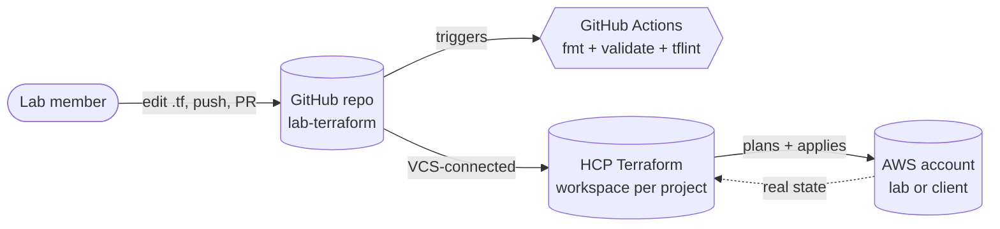
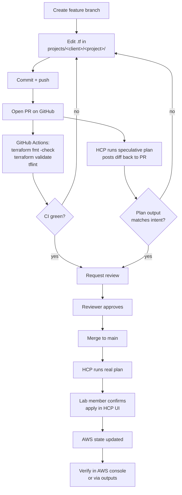
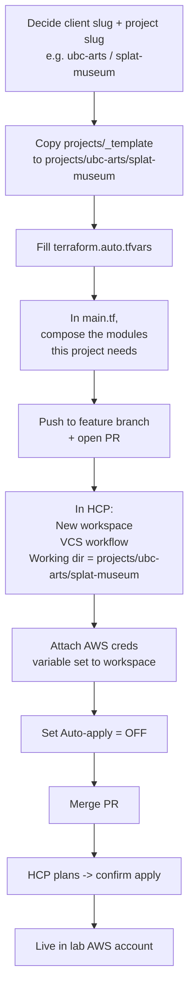
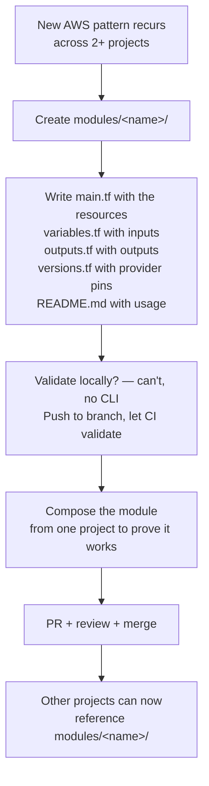
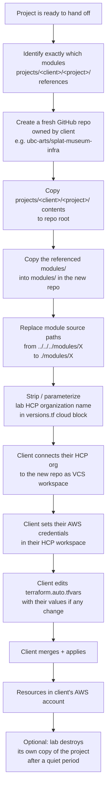
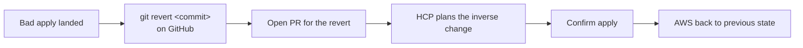

# Workflow diagrams

All diagrams use [Mermaid](https://mermaid.js.org/), which GitHub renders natively. If you're reading this in a plain-text editor and seeing source code instead of pictures, open the file on GitHub.

## 1. The big picture — who talks to what

GitHub is the source of truth. HCP turns the truth into AWS resources. CI checks the truth is syntactically valid before we trust it.

---

## 2. Daily workflow — making a change to an existing project

---

## 3. Starting a new client project

---

## 4. Adding a new reusable module

Rule of thumb: don't pre-build a module for "we might need this someday." Start in a project. When a second project wants the same shape, extract.

---

## 5. Transplanting a project to a client (delivery)

Full step-by-step lives in [`transplant.md`](./transplant.md).

---

## 6. Reverting a bad change

Infrastructure-as-code's superpower: `git revert` is your undo button.
