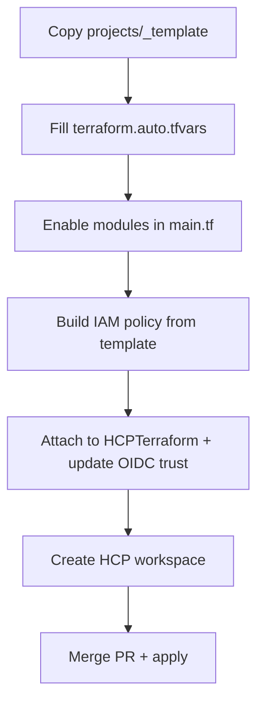

# HCP Terraform IAM policy — new project guide

When you start a new lab project, HCP Terraform needs permission to create and manage AWS resources on your behalf. The lab uses **one shared IAM role** (`HCPTerraform`) with **OIDC dynamic credentials**. You do **not** create a new runner role per project — you **add a scoped policy** for the new project's resource prefix.

This guide explains how to build that policy from the template, which statement blocks to keep based on the modules you enable, and how to attach it in AWS.

**Related files**

| File | Purpose |
|------|---------|
| [`hcp-terraform-policy.template.json`](./hcp-terraform-policy.template.json) | Main policy — copy and customize per project |
| [`hcp-terraform-cloudfront-response-headers-inline.template.json`](./hcp-terraform-cloudfront-response-headers-inline.template.json) | Optional supplemental inline policy when the main policy hits the 6144-byte limit |
| [`hcp-terraform-virtual-soils-policy.json`](./hcp-terraform-virtual-soils-policy.json) | Worked example (Virtual Soils) |
| [`virtual-soils-hcp-deployment.md`](../virtual-soils-hcp-deployment.md) | Debugging notes from the first real deployment |

---

## Roles you are *not* creating here

| Role | Who creates it | Notes |
|------|----------------|-------|
| **Lambda / service execution roles** | Terraform modules (`lambda-http-api`, etc.) | Scoped to `REPLACE_NAME_PREFIX-*`; `HCPTerraform` only needs `iam:CreateRole` + `iam:PassRole` |
| **GitHub Actions deploy role** | Manual, per app repo | Narrower — S3 sync + CloudFront invalidation only. See [`github-deploy-virtual-soils-policy.json`](./github-deploy-virtual-soils-policy.json) for the pattern |
| **Client HCP role (transplant)** | Client's AWS account | See [`transplant.md`](../transplant.md) |

---

## Workflow

### 1. Know your name prefix

From `terraform.auto.tfvars`, the prefix is:

```text
${client_name}-${project_name}-${environment}
```

Example: `client_name = "ubc-arts"`, `project_name = "splat-museum"`, `environment = "dev"` → **`ubc-arts-splat-museum-dev`**.

All scoped ARNs in the policy use this prefix. It must match [`docs/conventions.md`](../conventions.md).

### 2. Copy the template

```powershell
Copy-Item docs\iam\hcp-terraform-policy.template.json docs\iam\hcp-terraform-<client>-<project>-policy.json
```

Commit the project-specific file to git so console edits are recoverable.

### 3. Replace placeholders

Find-and-replace in your copy:

| Placeholder | Example value | Where to find it |
|-------------|---------------|------------------|
| `REPLACE_AWS_ACCOUNT_ID` | `940309384764` | AWS console → account menu |
| `REPLACE_AWS_REGION` | `ca-central-1` | `aws_region` in `terraform.auto.tfvars` |
| `REPLACE_NAME_PREFIX` | `ubc-arts-splat-museum-dev` | `${client_name}-${project_name}-${environment}` |

### 4. Delete statement blocks you do not need

The template includes every statement block the lab has needed so far. **Remove entire statement objects** (from `{` through `},`) for services your project will not use.

Use this table — match against the modules you uncomment in `main.tf`:

| Module | Keep these `Sid` values | Also required |
|--------|-------------------------|---------------|
| *(always)* | `TerraformReadIdentity` | Every project |
| `dynamodb-table` | `DynamoDBProject` | |
| `cognito-user-pool` | `CognitoProject`, `CognitoDescribeUserPoolDomainGlobal` | Global describe is an AWS quirk — keep both |
| `lambda-http-api` | `LambdaProject`, `ApiGatewayV2Project`, `LogsDescribeAccount`, `LogsProject`, `IAMRolesProject`, `IAMPassRoleToLambda`, `AttachLambdaBasicExecution` | If Lambda reads DynamoDB, also keep `DynamoDBProject` |
| `s3-static-site` | `S3Project`, `CloudFrontProject`, `CloudFrontListAccount` | |
| `s3-assets-bucket` | `S3Project` | Add `CloudFrontProject` + `CloudFrontListAccount` when `enable_cdn = true` |
| `iam-api-invoker` | `IAMOptionalApiInvokerUser` | Optional; only if `create_iam_api_invoker = true` |
| `ec2-gpu-worker` | *(not yet defined)* | Module is still a TODO template — add permissions when the module is implemented |
| `ecs-fargate-service` | *(not yet defined)* | Module is still a TODO template — add permissions when the module is implemented |

**Deduplicate:** If you use both `s3-static-site` and `s3-assets-bucket`, keep one `S3Project` and one `CloudFrontProject` block — do not duplicate them.

### 5. Importing legacy resources (optional)

If you `terraform import` a pre-existing table or bucket with a name **outside** the `${name_prefix}-*` pattern, add explicit ARNs to the relevant `Resource` arrays (see Virtual Soils: `eml_fields`, `eml-soils-db` in [`hcp-terraform-virtual-soils-policy.json`](./hcp-terraform-virtual-soils-policy.json)).

### 6. Attach to `HCPTerraform`

Attach your project policy to the existing **`HCPTerraform`** OIDC role in the lab AWS account:

- **Customer managed policy** — name it `HCPTerraform-<client>-<project>` and attach to `HCPTerraform`, or
- **Inline policy** — name it `<client>-<project>` on the same role.

Multiple projects can each have their own policy document on the one role. Permissions are additive.

**OIDC trust:** Ensure the `HCPTerraform` trust policy allows your new HCP workspace to assume the role. See [HashiCorp dynamic credentials](https://developer.hashicorp.com/terraform/cloud-docs/workspaces/dynamic-provider-credentials/aws-configuration).

### 7. Policy size limit

AWS customer managed policies max out at **6144 characters**. If attach fails or you trim CloudFront response-headers actions to save space:

1. Copy [`hcp-terraform-cloudfront-response-headers-inline.template.json`](./hcp-terraform-cloudfront-response-headers-inline.template.json) → `hcp-terraform-<client>-<project>-cloudfront-inline.json`
2. Replace `REPLACE_AWS_ACCOUNT_ID`
3. Attach as an **inline** policy on `HCPTerraform` (e.g. policy name `CloudFrontResponseHeaders-<project>`)

Virtual Soils uses this pattern — see [`virtual-soils-hcp-deployment.md`](../virtual-soils-hcp-deployment.md#final-iam-policy).

### 8. Iterate on apply failures

Expect **2–3 apply cycles** the first time. Terraform's AWS provider calls many `Describe*`, `Get*`, and tag APIs during plan and refresh that are not obvious from `.tf` files. When HCP apply fails with `AccessDenied`:

1. Note the missing action and resource from the error.
2. Add it to the **smallest scope** that works — prefer `REPLACE_NAME_PREFIX-*` over `*`.
3. Re-run plan/apply.

Do **not** grant `AdministratorAccess` to `HCPTerraform`.

---

## Checklist (new project)

- [ ] Copied `hcp-terraform-policy.template.json` → `hcp-terraform-<client>-<project>-policy.json`
- [ ] Replaced `REPLACE_AWS_ACCOUNT_ID`, `REPLACE_AWS_REGION`, `REPLACE_NAME_PREFIX`
- [ ] Removed unused statement blocks per module table above
- [ ] Added legacy ARNs if importing existing resources
- [ ] Attached policy to `HCPTerraform` (not a new role)
- [ ] Updated OIDC trust for the new HCP workspace
- [ ] Wired workspace to `HCPTerraform` dynamic credentials in HCP
- [ ] First apply succeeded (or policy updated after `AccessDenied` and re-applied)

---

## Where this fits in project setup

Full new-project steps: [`deliverable.md` §4](../../deliverable.md#4-starting-a-new-client-project). IAM policy work happens **after** you choose modules in `main.tf` and **before** the first apply in HCP.


